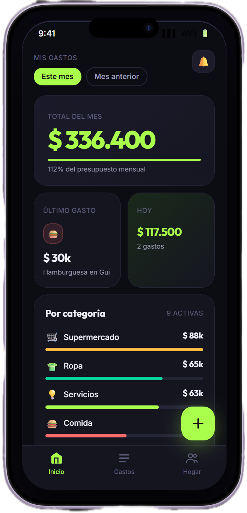

<h1 align="center">Wallai</h1>

<p align="center">
  Control de gastos personales y del hogar.<br>
  Escribis el gasto como se lo contarias a alguien por mensaje,<br>
  y un motor propio lo categoriza solo.
</p>

<br>

<p align="center">
  
</p>

<p align="center">
  <sub><b>El dashboard.</b> Cuanto gasto la casa este mes, con el desglose por categoria y por persona.</sub>
</p>

<br>

## Que es

Una app de gastos para una familia. La carga es una sola frase:

```
30000 hamburguesa en Guido
```

De ahi el sistema saca el monto (el numero que abre el texto, o cualquiera
marcado con "$" o "pesos"), la fecha si la mencionaste, y le asigna una
categoria. Cuando se equivoca, la corregis una vez y no se vuelve a equivocar
con textos parecidos: esa correccion queda guardada y beneficia a todo el grupo.

**El diferencial no es el tageo ni el multiusuario por separado**, que ya
existen. Es la combinacion, con el foco puesto en *"cuanto gasto la casa este
mes"* y **no** en *"quien le debe a quien"*. Esa distincion define lo que el
proyecto decide no construir: nada de saldos entre personas, liquidaciones ni
deudas.

El alcance, el modelo de datos y el stack estan definidos en el documento de
producto.

## Estado actual

**La app esta desplegada y en uso.** El backend corre en Vercel y hay un APK
instalado en un telefono real: se carga un gasto con la computadora apagada y
funciona. Hasta la fase 4.1 la app solo vivia mientras la maquina de desarrollo
tenia dos servidores prendidos y el telefono estaba en la misma Wi-Fi.

| Fase | Que | Estado |
|---|---|---|
| 1 | Monorepo, modelo de datos, auth con Supabase, API tRPC | Completa |
| 2 | Parser de monto y fecha, motor de tageo que aprende | Completa |
| 3 | Grupos compartidos, app mobile, editar y borrar gastos | Completa |
| 3.5 | Varios grupos a la vez, gastos privados, diccionario del motor | Completa |
| 4.1 | Deploy del backend en Vercel y build de Android con EAS | Completa |
| 4.2 | Objetivos de gasto, notificaciones, pulido de UI | Pendiente |

La version instalada es la **1.2.0**. Lo que trajeron las dos ultimas salio
entero de usar la app todos los dias: el selector de que gastos se miran sin la
vista que mezclaba lo propio con lo de los demas, la correccion de categoria con
un paso de confirmar, el login con Google funcionando, el monto sin necesidad de
escribir "$" adelante, y el ojo para ver la contrasena al escribirla.

Lo que queda, en orden de cuanto se nota al usarla:

- **Objetivos de gasto**, la tabla existe desde la fase 1 pero no tiene ni
  backend ni pantalla.
- **Notificaciones push**, que son el resto de la fase 4.2.
- **Detalles de UI** que solo aparecen usandola a diario.

## Requisitos

- Node 22 o superior
- pnpm 12 (`corepack enable` lo activa a partir del campo `packageManager`)
- Una cuenta gratuita de Supabase

## Como correrlo

### 1. Lo que no necesita base de datos

```bash
pnpm install      # instala todo el workspace de una sola vez
pnpm test         # 61 tests en packages/validators
pnpm typecheck    # verifica los tipos de los 5 paquetes
```

Que deberias ver: los 61 tests en verde y los 5 paquetes sin errores de tipos.

### 2. Conectar la base de datos

1. Crear un proyecto gratuito en supabase.com.
2. Ir a Project Settings > Database y copiar la cadena de conexion del
   **Session pooler**, no la conexion directa. La directa resuelve a una IP
   IPv6 que en muchas redes no es alcanzable; el Session pooler es IPv4 y, a
   diferencia del Transaction pooler, soporta sentencias preparadas, que es lo
   que necesitan las migraciones de Drizzle.
3. Copiar `.env.example` a `.env` en la raiz del repositorio y completar los
   valores. El archivo de ejemplo explica que es cada variable y de donde
   sacarla.

```bash
pnpm --filter @wallai/db db:migrar     # crea las tablas
pnpm --filter @wallai/db db:seed       # carga las 11 categorias globales
pnpm --filter @wallai/db db:verificar  # prueba de humo del modelo de datos
```

`db:verificar` arma un hogar de mentira con dos miembros y unos gastos, corre
las consultas del dashboard, comprueba que la base rechace los datos invalidos,
y al final **revierte todo**: no deja nada cargado, asi que es seguro correrlo
contra la base real. Termina en "Todo bien".

### 3. Levantar la app en desarrollo

Esto es solo para desarrollar. La app instalada desde el APK no necesita nada de
esto: habla con el backend desplegado y funciona con la computadora apagada.

Son dos terminales, porque la app mobile necesita el backend corriendo:

```bash
pnpm --filter @wallai/web dev      # 1) backend tRPC en localhost:3000
pnpm --filter @wallai/mobile dev   # 2) Metro, y el QR para Expo Go
```

El telefono tiene que estar en la misma red Wi-Fi que la maquina. La URL del
backend se deduce sola de la direccion por la que Expo sirve el bundle, asi que
no hay que escribir ninguna IP a mano.

## Variables de entorno

Van en un `.env` en la raiz del monorepo, no dentro de cada app. Hay un
`.env.example` con la lista completa y el porque de cada una; el `.env` de
verdad esta ignorado por git, asi que las claves nunca se commitean.

| Variable | Para que | Donde se usa |
|---|---|---|
| `DATABASE_URL` | Cadena de conexion a PostgreSQL | Backend y migraciones |
| `SUPABASE_URL` | URL del proyecto de Supabase | Backend y app mobile |
| `SUPABASE_ANON_KEY` | Clave publica, pensada para exponerse | Solo la app mobile |
| `SUPABASE_SERVICE_ROLE_KEY` | Clave de servicio para verificar los JWT | **Solo el backend** |

La clave de servicio ignora las politicas de acceso de la base y **nunca** debe
llegar al cliente. Por eso `app.config.ts` expone unicamente la URL y la clave
anonima a la app mobile.

Un detalle util para el deploy: `SUPABASE_ANON_KEY` no hace falta en el servidor,
y `SUPABASE_SERVICE_ROLE_KEY` no hace falta en el build de la app.

## Despliegue

**El backend** (`apps/web`) va a Vercel, con el Root Directory apuntado a
`apps/web` y las tres variables del servidor cargadas en el panel. Dos cosas que
no son obvias:

- Vercel no soporta pnpm 12 en su imagen de build, asi que hay que activar
  Corepack con la variable `ENABLE_EXPERIMENTAL_COREPACK=1`. Con eso respeta el
  campo `packageManager` del `package.json` y usa la version exacta.
- `packages/api` lee las variables **al cargarse el modulo**, no al recibir un
  request. Eso significa que si faltan, falla el build entero y no un request
  suelto. Hay que cargarlas antes del primer deploy.

**La app** se construye con EAS: `eas build --platform android --profile
preview` produce un APK instalable a mano. Las variables van declaradas dentro
de `eas.json` y no se leen del `.env`, porque ese archivo esta en `.gitignore` y
no existe en los servidores de EAS. Que queden escritas ahi no expone nada
nuevo: son las mismas tres que ya viajan dentro del APK, porque `app.config.ts`
las pone en `extra` y eso queda embebido en el bundle.

Lo que hace que la app deje de depender de la maquina de desarrollo es
`WALLAI_URL_API`. Sin esa variable, `lib/entorno.ts` deduce la direccion del
backend a partir del servidor de Expo, que es lo correcto en desarrollo y no
existe en un build independiente.

## Estructura

```
apps/
  web/            Next.js (App Router). Hostea el backend tRPC.
  mobile/         Expo Router + NativeWind. La app de verdad.
    app/          Rutas. (sesion)/ exige sesion; el resto es publico.
                  (sesion)/: dashboard, historial, grupos.
                  gasto/nuevo, grupo/crear, grupo/unirse, login.
    componentes/  Piezas visuales compartidas entre pantallas.
    lib/          Cliente de Supabase, sesion, tRPC, formato y presentacion.
packages/
  validators/     Zod y logica de dominio pura. Sin acceso a base ni servidor,
                  que es lo que permite usarlo tambien desde la app mobile.
  db/             Schema de Drizzle, migraciones, cliente, seed y verificacion.
    src/schema/   Una tabla por archivo, con el porque de cada decision.
    migraciones/  SQL generado. Se commitea: es el historial de la base.
  api/            Routers de tRPC (gastos, hogares, categorias), puente del JWT
                  y el motor de tageo.
```

## El modelo de datos en una linea cada tabla

- `usuarios` — perfil publico. **No guarda contrasenas**: de eso se encarga
  Supabase Auth en su propio esquema.
- `hogares` — la unidad de agregacion, con su codigo de invitacion y su tipo
  (una casa o un grupo).
- `usuario_hogar` — quien pertenece a que grupo (muchos a muchos: una persona
  puede estar en varios).
- `categorias` — globales del sistema (`hogar_id` nulo) o propias de un grupo.
- `gastos` — la tabla central. Montos en centavos enteros, fecha sin hora.
- `reglas_tageo` — la memoria del motor: cada correccion del usuario queda aca.
- `objetivos` — limites de gasto por persona o por grupo.

Cada archivo en `packages/db/src/schema/` explica en comentarios por que la
tabla es como es. Vale la pena leerlos antes de tocar nada.

## Como funciona el motor de tageo

No hay ningun modelo entrenado ni IA generativa, y no es una limitacion: la
promesa del producto es "corregilo una vez y no se vuelve a equivocar con algo
parecido", y eso se cumple con busqueda por similitud sobre las correcciones ya
hechas. En orden:

1. **Reglas aprendidas.** Cada correccion guarda una fila en `reglas_tageo` que
   dice "este texto es de esta categoria". Ante un gasto nuevo, Fuse.js busca el
   patron mas parecido. Las reglas pertenecen al grupo y no a la persona, asi
   que si uno ensena que "medialunas" es comida, todos se benefician.
2. **Diccionario base.** Si nadie enseno nada todavia, una tabla de palabras del
   gasto argentino escrita a mano resuelve los casos tipicos. Existe para el
   problema del arranque en frio: sin ella, el primer dia de un grupo nuevo
   **todo** caia en "Otros".
3. **"Otros".** Si ninguno de los dos reconoce el texto, no se arriesga una
   categoria. Una sugerencia equivocada hace perder mas tiempo que ninguna.

## Por que el monorepo

Los tipos y las validaciones se escriben una vez y se usan en los tres lados. Si
manana se agrega un campo al gasto, el error aparece al instante en la app mobile
y en la web, sin documentacion de API que se desactualice. Esa es la razon por la
que el documento eligio tRPC y TypeScript de punta a punta.

## Notas

- El dinero se guarda siempre como **centavos enteros**, nunca como decimales.
  El porque esta explicado en `packages/validators/src/dinero.ts`.
- `pnpm-workspace.yaml` fija `nodeLinker: hoisted` porque Metro, el bundler de
  Expo, no resuelve bien los symlinks que pnpm usa por defecto. Va en ese
  archivo y no en `.npmrc`: desde pnpm 10 las opciones propias de pnpm se leen
  del YAML y las del `.npmrc` se ignoran sin avisar.
- Las migraciones se commitean siempre. Son el historial de como llego la base a
  su forma actual, y es lo que permite recrearla desde cero en otra maquina.
  Nunca se edita una migracion ya aplicada: se genera una nueva.
- Si PostgreSQL deja de responder pero el login sigue andando, probablemente la
  red este filtrando los puertos 5432 y 6543.
- **El login social no puede depender de que la app siga viva.** Al volver del
  navegador por un esquema propio (`wallai://`), Android puede levantar la app
  de cero: el proceso arranca nuevo y la funcion que esperaba el retorno
  desaparece con todo el estado, asi que el codigo de autorizacion llega a una
  app que ya no lo espera. El sintoma es tan mudo como enganoso: se vuelve a la
  pantalla de login sin sesion y sin ningun error. Por eso el canje tambien se
  hace desde un escucha de deep links (`lib/sesion.tsx`), que funciona venga la
  app de cero o de segundo plano.
- **Para saber que URL de retorno acepta Supabase, preguntarle a la base.**
  GoTrue guarda en `auth.flow_state.referrer` el retorno ya validado contra la
  lista de Redirect URLs: si se pide una URL permitida queda esa, y si no queda
  la Site URL. Es una respuesta directa, a diferencia de `generate_link`, que da
  falsos negativos con los esquemas propios.
- **Toda tabla nueva necesita `ENABLE ROW LEVEL SECURITY` en su migracion.**
  Supabase no expone la base solo por este backend: publica ademas cada tabla en
  una API REST automatica a la que se entra con la clave anonima, que es publica
  por diseno y viaja dentro del APK. Lo unico que la hace segura es RLS, y **RLS
  viene desactivado en las tablas creadas por migraciones propias**: solo las
  creadas desde el panel de Supabase lo traen puesto. La migracion `0006` lo
  activa en las 7 tablas actuales, sin politicas, porque en esta arquitectura el
  cliente nunca habla con la base directamente. El backend no se entera porque
  se conecta con el rol duenio de las tablas, que ignora RLS.
- **Una funcion nueva en `public` tambien nace con permisos de mas.** PostgreSQL
  le da EXECUTE a PUBLIC por defecto, y Supabase agrega ademas `anon`,
  `authenticated` y `service_role` por privilegios predeterminados. En una
  funcion `SECURITY DEFINER` eso importa, porque corre con los privilegios de su
  duenio y no con los de quien la llama. La migracion `0007` se lo saca a la
  unica que hay (la del alta de perfiles) y le fija un `search_path` vacio. Toda
  funcion `SECURITY DEFINER` nueva lleva su propio REVOKE en su migracion.

## Licencia

Apache 2.0. Se puede usar, modificar y redistribuir, incluso comercialmente,
manteniendo el aviso de copyright y dejando constancia de los cambios. El texto
completo esta en [LICENSE](LICENSE).
